# gantt-streamer
Creates gantt chart with serialized work streams. Takes in a "|" separated file with lines in this format:
```
<task id, preceded by ! if critical>|<task name>|<cost in days>|<whitespace separated dependency task ids>|<work stream name (can be empty)>|<optional: start date>
```

Outputs a mermaid-cli-generated Gantt chart SVG where the tasks are serialized by work stream. This can be useful to come up with a delivery plan for
a project given a set number of people doing the work. Mermaid handles explicitly specified dependencies, but there's no way to easily divide the
tasks up into work streams. This tool converts the input to a mermaid chart definition where each task within the same work stream has an additional
dependency on the preceding task in the same work stream.

For example:
```
Sample
task1|Some task|5||bob|2021-08-09
task2|Some other task|3||bob
task3|Yet another task|4|task1|alice
task4|Yet another other task|2|task1|alice
task5|Not yet assigned|6|task2||
```

Produces the following chart:



## Usage

Create a `.gs` file in the root directory, for example `test-input.gs`. Then run `yarn start test-input`. The output will be located at `test-input.svg`.
